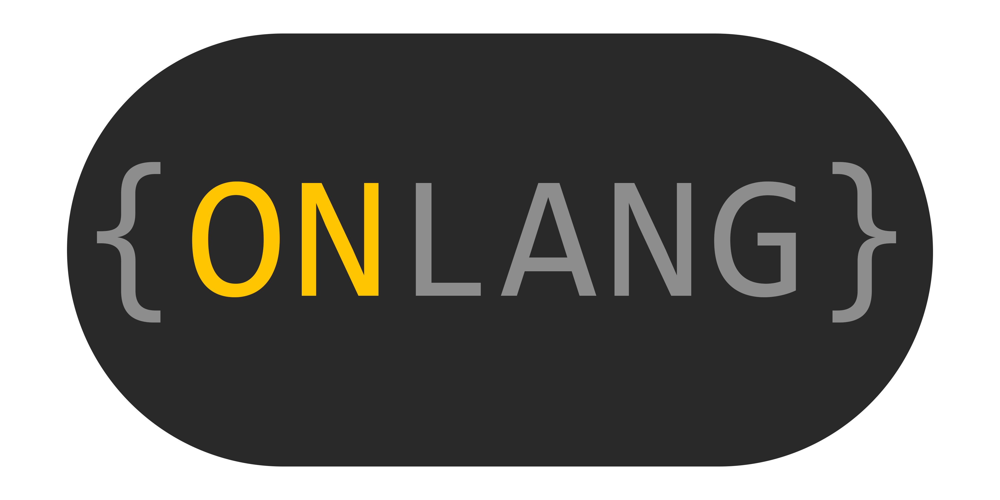

# You may have questions

ONLang - Object Notation Language (js`ON`)

## 1. God, what the f\*\*\*\* is this

ONLang is an experimental, esoteric programming language, that allows you to use (**json or yaml**) for **PROGRAMMING**. The interpreter currently supports only json5 format.

## 2. What is it for

For writing simple scripts.

## 3. How run scripts

1. Add the executable file to the path variable
2. `on example/example.json5`

or

1. Clone this repo
2. `cargo run --quiet --release -- example/example.json5`

## 4. How to write in this language

[Documentation](doc/main.md)

If you want to help create a pull request
